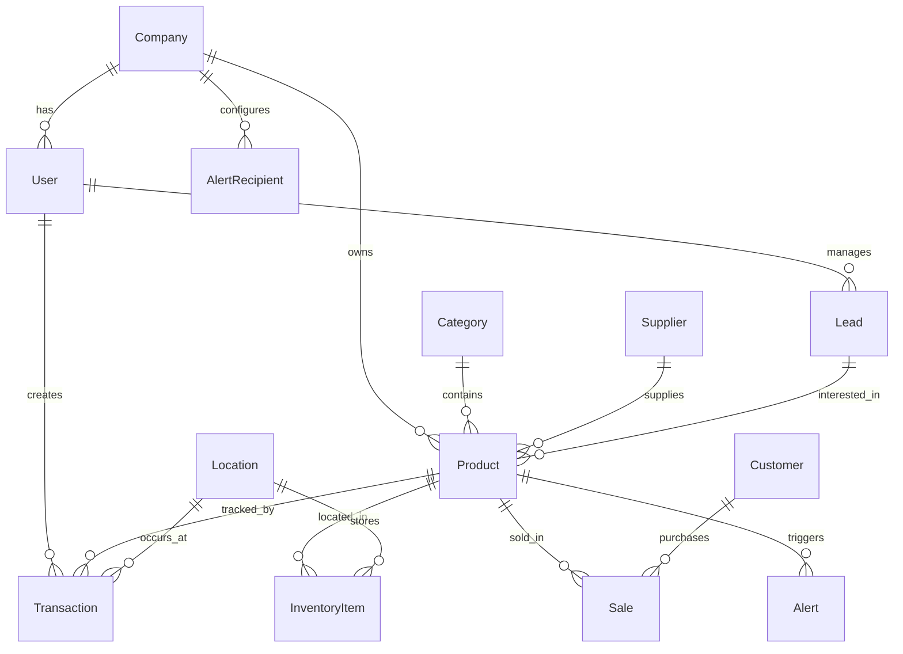

# 🗄️ ESQUEMA DE BASE DE DATOS - DataLens MVP

## 📊 **RESUMEN GENERAL**

```
┌─────────────────────────────────────────────────────────────────┐
│                    SISTEMA DATALENS MVP                        │
│                     Base de Datos Django                       │
│                                                                 │
│  🏢 Empresas → 👥 Usuarios → 📦 Productos → 📊 Analytics        │
└─────────────────────────────────────────────────────────────────┘
```

### 📈 **Estadísticas de la DB**
- **Módulos**: 8 aplicaciones Django
- **Tablas principales**: ~20 modelos
- **Relaciones**: Multi-tenant (por empresa)
- **Motor**: PostgreSQL/SQLite
- **ORM**: Django ORM

---

## 🏗️ **ARQUITECTURA MODULAR**

```
📁 APLICACIONES DJANGO
├── 🔐 authentication/     # Usuarios y empresas
├── 📦 inventory/          # Productos, stock, transacciones
├── 🚨 alerts/             # Sistema de alertas
├── 📊 forecasting/        # Predicciones ML
├── 📋 reports/            # Reportes y análisis
├── 📤 data_import/        # Importación de datos
├── 🤖 chatbot/           # Asistente IA
└── 🧠 intelligence/       # Analytics avanzados
```

---

## 🔗 **DIAGRAMA DE RELACIONES PRINCIPALES**



---

## 📋 **MODELOS DETALLADOS**

### 🔐 **AUTHENTICATION** (Usuarios y Empresas)

#### **Company** (Empresa)
```sql
┌─────────────────────────────────────────────┐
│                 COMPANY                     │
├─────────────────────────────────────────────┤
│ 🔑 id (AutoField)                          │
│ 📝 name (CharField)                        │
│ 🏢 ruc (CharField, unique)                 │
│ 📍 address (TextField)                     │
│ 📞 phone (CharField)                       │
│ 📧 email (EmailField)                      │
│ 🏭 industry (CharField)                    │
│ 🌐 website (URLField)                      │
│ 👥 max_users (PositiveIntegerField)        │
│ 💎 subscription_type (CharField)           │
│ ✅ is_active (BooleanField)                │
│ 📅 created_at (DateTimeField)              │
│ 📅 updated_at (DateTimeField)              │
└─────────────────────────────────────────────┘
```

#### **User** (Usuario) - Extends AbstractUser
```sql
┌─────────────────────────────────────────────┐
│                  USER                       │
├─────────────────────────────────────────────┤
│ 🔑 id (AutoField)                          │
│ 👤 username (CharField, unique)            │
│ 📧 email (EmailField)                      │
│ 🔒 password (CharField)                    │
│ 👤 first_name (CharField)                  │
│ 👤 last_name (CharField)                   │
│ 🏢 company (ForeignKey → Company)          │
│ 👨‍💼 role (CharField)                        │
│ 📞 phone (CharField)                       │
│ ✅ is_active (BooleanField)                │
│ 📅 date_joined (DateTimeField)             │
└─────────────────────────────────────────────┘
```

---

### 📦 **INVENTORY** (Gestión de Inventario)

#### **Category** (Categoría)
```sql
┌─────────────────────────────────────────────┐
│                CATEGORY                     │
├─────────────────────────────────────────────┤
│ 🔑 id (AutoField)                          │
│ 📝 name (CharField, unique)                │
│ 📄 description (TextField)                 │
│ ✅ is_active (BooleanField)                │
│ 📅 created_at (DateTimeField)              │
│ 📅 updated_at (DateTimeField)              │
└─────────────────────────────────────────────┘
```

#### **Supplier** (Proveedor)
```sql
┌─────────────────────────────────────────────┐
│               SUPPLIER                      │
├─────────────────────────────────────────────┤
│ 🔑 id (AutoField)                          │
│ 🏢 name (CharField)                        │
│ 👤 contact_name (CharField)                │
│ 📧 email (EmailField)                      │
│ 📞 phone (CharField)                       │
│ 📍 address (TextField)                     │
│ 🏙️ city (CharField)                        │
│ 🌍 country (CharField)                     │
│ 🆔 tax_id (CharField)                      │
│ 💳 payment_terms (CharField)               │
│ ✅ is_active (BooleanField)                │
│ 📅 created_at (DateTimeField)              │
│ 📅 updated_at (DateTimeField)              │
└─────────────────────────────────────────────┘
```

#### **Product** (Producto) - MODELO CENTRAL
```sql
┌─────────────────────────────────────────────┐
│                PRODUCT                      │
├─────────────────────────────────────────────┤
│ 🔑 id (AutoField)                          │
│ 📝 name (CharField)                        │
│ 🏷️ sku (CharField, unique)                 │
│ 📄 description (TextField)                 │
│ 🏢 company (FK → Company)                  │
│ 📂 category (FK → Category)                │
│ 🏭 supplier (FK → Supplier)                │
│ 💰 cost_price (DecimalField)               │
│ 💲 sale_price (DecimalField)               │
│ 📦 stock (IntegerField)                    │
│ 📉 min_stock (IntegerField)                │
│ 📈 max_stock (IntegerField)                │
│ 🔄 reorder_point (IntegerField)            │
│ 📏 unit (CharField)                        │
│ 🏷️ barcode (CharField)                     │
│ ⚖️ weight (DecimalField)                   │
│ 📐 dimensions (CharField)                  │
│ 🏷️ track_batches (BooleanField)            │
│ ⏰ has_expiration (BooleanField)           │
│ 📅 shelf_life_days (PositiveIntegerField)  │
│ ✅ is_active (BooleanField)                │
│ 📅 created_at (DateTimeField)              │
│ 📅 updated_at (DateTimeField)              │
└─────────────────────────────────────────────┘
```

#### **Location** (Ubicación)
```sql
┌─────────────────────────────────────────────┐
│               LOCATION                      │
├─────────────────────────────────────────────┤
│ 🔑 id (AutoField)                          │
│ 📝 name (CharField)                        │
│ 🔖 code (CharField, unique)                │
│ 📄 description (TextField)                 │
│ 🏪 warehouse (CharField)                   │
│ 🗺️ zone (CharField)                        │
│ 🛤️ aisle (CharField)                       │
│ 🗄️ rack (CharField)                        │
│ 📚 shelf (CharField)                       │
│ ✅ is_active (BooleanField)                │
│ 📅 created_at (DateTimeField)              │
│ 📅 updated_at (DateTimeField)              │
└─────────────────────────────────────────────┘
```

#### **Transaction** (Transacción de Inventario)
```sql
┌─────────────────────────────────────────────┐
│              TRANSACTION                    │
├─────────────────────────────────────────────┤
│ 🔑 id (AutoField)                          │
│ 📦 product (FK → Product)                  │
│ 📍 location (FK → Location)                │
│ 🔄 transaction_type (CharField)            │
│   • sale, purchase, adjustment,            │
│   • transfer, return, waste, usage         │
│ 📊 quantity (DecimalField)                 │
│ 💰 unit_cost (DecimalField)                │
│ 📋 reference_number (CharField)            │
│ 📝 notes (TextField)                       │
│ 📅 transaction_date (DateTimeField)        │
│ 👤 created_by (FK → User)                  │
└─────────────────────────────────────────────┘
```

#### **Sale** (Venta)
```sql
┌─────────────────────────────────────────────┐
│                 SALE                        │
├─────────────────────────────────────────────┤
│ 🔑 id (AutoField)                          │
│ 📦 product (FK → Product)                  │
│ 📊 quantity (IntegerField)                 │
│ 💲 unit_price (DecimalField)               │
│ 💰 total_amount (DecimalField)             │
│ 📅 date_sold (DateTimeField)               │
│ 👤 customer_name (CharField)               │
└─────────────────────────────────────────────┘
```

#### **Customer** (Cliente)
```sql
┌─────────────────────────────────────────────┐
│               CUSTOMER                      │
├─────────────────────────────────────────────┤
│ 🔑 id (AutoField)                          │
│ 👤 name (CharField)                        │
│ 📧 email (EmailField)                      │
│ 📞 phone (CharField)                       │
│ 📍 address (TextField)                     │
│ 🏙️ city (CharField)                        │
│ 🌍 country (CharField)                     │
│ 🆔 tax_id (CharField)                      │
│ 👔 customer_type (CharField)               │
│   • individual, business                   │
│ 💳 credit_limit (DecimalField)             │
│ ✅ is_active (BooleanField)                │
│ 📅 created_at (DateTimeField)              │
│ 📅 updated_at (DateTimeField)              │
└─────────────────────────────────────────────┘
```

#### **Lead** (Prospecto)
```sql
┌─────────────────────────────────────────────┐
│                 LEAD                        │
├─────────────────────────────────────────────┤
│ 🔑 id (AutoField)                          │
│ 👤 name (CharField)                        │
│ 📧 email (EmailField)                      │
│ 📞 phone (CharField)                       │
│ 🏢 company (CharField)                     │
│ 📊 source (CharField)                      │
│   • web, phone, email, referral, social    │
│ 📈 status (CharField)                      │
│   • new, contacted, qualified, proposal,   │
│   • negotiation, won, lost                 │
│ 📦 interested_products (M2M → Product)     │
│ 📝 notes (TextField)                       │
│ 💰 estimated_value (DecimalField)          │
│ 📅 expected_close_date (DateField)         │
│ 👤 assigned_to (FK → User)                 │
│ 📅 created_at (DateTimeField)              │
│ 📅 updated_at (DateTimeField)              │
└─────────────────────────────────────────────┘
```

---

### 🚨 **ALERTS** (Sistema de Alertas)

#### **AlertRecipient** (Destinatario de Alertas)
```sql
┌─────────────────────────────────────────────┐
│            ALERT_RECIPIENT                  │
├─────────────────────────────────────────────┤
│ 🔑 id (AutoField)                          │
│ 🏢 company (FK → Company)                  │
│ 👤 name (CharField)                        │
│ 📧 email (EmailField)                      │
│ 📞 phone (CharField)                       │
│ 📢 notification_type (CharField)           │
│   • email, whatsapp, both                  │
│ 🔔 receive_all_alerts (BooleanField)       │
│ 🚨 receive_critical_only (BooleanField)    │
│ ⚠️ receive_high_and_critical (Boolean)     │
│ 📋 alert_types (JSONField)                 │
│ ✅ is_active (BooleanField)                │
│ 📅 created_at (DateTimeField)              │
│ 📅 updated_at (DateTimeField)              │
│ 👤 created_by (FK → User)                  │
└─────────────────────────────────────────────┘
```

#### **Alert** (Alerta)
```sql
┌─────────────────────────────────────────────┐
│                ALERT                        │
├─────────────────────────────────────────────┤
│ 🔑 id (AutoField)                          │
│ 📝 message (TextField)                     │
│ ⚠️ severity (CharField)                     │
│   • low, medium, high                      │
│ ✅ is_active (BooleanField)                │
│ 📅 created_at (DateTimeField)              │
│ 📦 product (FK → Product)                  │
└─────────────────────────────────────────────┘
```

---

### 📊 **FORECASTING** (Predicciones ML)

#### **ForecastModel** (Modelo de Predicción)
```sql
┌─────────────────────────────────────────────┐
│            FORECAST_MODEL                   │
├─────────────────────────────────────────────┤
│ 🔑 id (AutoField)                          │
│ 🏢 company (FK → Company)                  │
│ 📝 name (CharField)                        │
│ 📄 description (TextField)                 │
│ 🤖 model_type (CharField)                  │
│   • prophet, arima, linear_regression,     │
│   • random_forest, lstm                    │
│ 📊 status (CharField)                      │
│   • training, active, deprecated, failed   │
│ 📦 products (M2M → Product)                │
│ 📂 categories (M2M → Category)             │
│ 📅 created_at (DateTimeField)              │
│ 📅 updated_at (DateTimeField)              │
└─────────────────────────────────────────────┘
```

---

## 🔗 **RELACIONES PRINCIPALES**

### **One-to-Many (1:N)**
```
Company (1) ←→ (N) User
Company (1) ←→ (N) Product
Company (1) ←→ (N) AlertRecipient
Category (1) ←→ (N) Product
Supplier (1) ←→ (N) Product
Product (1) ←→ (N) Transaction
Product (1) ←→ (N) Sale
Product (1) ←→ (N) Alert
Location (1) ←→ (N) InventoryItem
User (1) ←→ (N) Transaction
User (1) ←→ (N) Lead
```

### **Many-to-Many (N:N)**
```
Lead (N) ←→ (N) Product (interested_products)
ForecastModel (N) ←→ (N) Product
ForecastModel (N) ←→ (N) Category
```

---

## 📊 **DATOS DE EJEMPLO ACTUALES**

### **Categorías** (15 categorías)
```
🥤 Bebidas (6 productos)
🛒 Abarrotes Básicos (4 productos)  
🥛 Lácteos y Derivados (4 productos)
🧴 Cuidado Personal (3 productos)
🍿 Snacks y Dulces (3 productos)
🍞 Panadería y Repostería (2 productos)
... y 9 categorías más
```

### **Productos** (29 productos activos)
```
Precio promedio: S/10.06 - S/18.01
Rango: S/3.34 - S/39.99
Stock actual: Variable por producto
Margen promedio: ~29.5%
```

---

## 🎯 **ÍNDICES Y OPTIMIZACIONES**

### **Índices Principales**
```sql
-- Búsquedas frecuentes
CREATE INDEX idx_product_sku ON inventory_product(sku);
CREATE INDEX idx_product_company ON inventory_product(company_id);
CREATE INDEX idx_transaction_date ON inventory_transaction(transaction_date);
CREATE INDEX idx_transaction_product ON inventory_transaction(product_id);

-- Filtros por estado
CREATE INDEX idx_product_active ON inventory_product(is_active);
CREATE INDEX idx_category_active ON inventory_category(is_active);

-- Analytics
CREATE INDEX idx_sale_date ON inventory_sale(date_sold);
CREATE INDEX idx_alert_created ON alerts_alert(created_at);
```

### **Constrains de Integridad**
```sql
-- Unicidad
UNIQUE(sku) -- Productos únicos
UNIQUE(company_id, email) -- Destinatarios únicos por empresa
UNIQUE(ruc) -- RUC único por empresa

-- Referencias foráneas
ON DELETE CASCADE -- Company → Product
ON DELETE SET_NULL -- Supplier → Product
ON DELETE PROTECT -- Category → Product (con productos)
```

---

## 🚀 **FUTURAS EXPANSIONES**

### **Nuevas Tablas Propuestas**
```
📊 CategoryAnalytics      # Métricas por categoría
📈 SalesTrend            # Tendencias de ventas
🔄 StockMovement         # Movimientos detallados
💰 PriceHistory          # Histórico de precios
📱 NotificationLog       # Log de notificaciones
🎯 BusinessRule          # Reglas de negocio
📋 ReportTemplate        # Plantillas de reportes
🔗 Integration           # Integraciones externas
```

### **Optimizaciones Futuras**
```
🔍 Full-text search en productos
📊 Vistas materializadas para analytics
🗂️ Particionado por fecha en transacciones
📱 Replicación read-only para reportes
💾 Archivado automático de datos antiguos
```

---

## 📝 **COMANDOS ÚTILES**

### **Inspeccionar la DB**
```bash
# Ver estructura
python manage.py inspectdb

# Generar migraciones
python manage.py makemigrations

# Aplicar migraciones
python manage.py migrate

# Ver estado de migraciones
python manage.py showmigrations
```

### **Consultas de Análisis**
```python
# Productos por categoría
Category.objects.annotate(product_count=Count('products'))

# Ventas del mes
Sale.objects.filter(date_sold__gte=datetime.now().replace(day=1))

# Productos con stock bajo
Product.objects.filter(stock__lt=F('min_stock'))

# Empresas activas
Company.objects.filter(is_active=True)
```

---

*🎯 **Esta base de datos está diseñada para escalabilidad, multi-tenancy y analytics avanzados, siendo la base sólida para el sistema DataLens MVP.***
